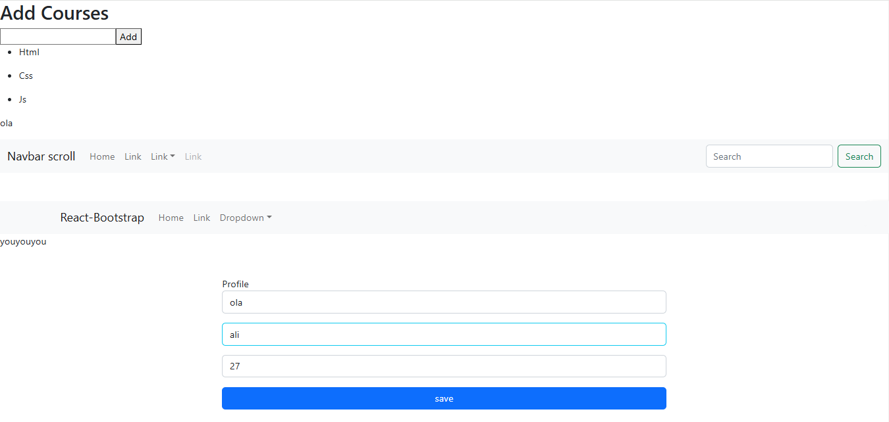

# someCode-forLearning-react-iti

not a project. it just some random code for crud,inputs built with react[hooks]+react-bootstrap

## Table of contents

- [Overview](#overview)
- [Installation](#Installation)
- [Usage](#Usage)
- [Links](#Links)
- [Author](#author)
- [Acknowledgments](#Acknowledgments)


## overview
not a project. it just some random code for crud,inputs built with react[hooks]+react-bootstrap

## Installation
To get started with this project, follow these steps:

you can clone the project or download it as Zip file.
1. Clone the repository:
   ```bash
   git clone https://github.com/olahasan/someCode-forLearning-react-iti.git

2. Navigate to the project directory:
   cd <project-directory>

3. Install the required dependencies:
   npm install   


## Usage
To run the application, use the following command:

npm start


## Links

If you want to open the link in a new tab, you can:

- Press **Ctrl** (or **Cmd** on Mac) while clicking the link.
- Right-click the link and select **Open link in new tab**.

Otherwise, all links will open in the same tab.


- Solution URL: [here](https://github.com/olahasan/someCode-forLearning-react-iti) 

- Live Site URL: [here](https://somecode-forlearning-react-iti.surge.sh/)   OR  [here]() 

 ## Screenshot
 



### Author

GitHub - @olahasan

### Acknowledgments

I would like to thank the **[iti](https://iti.gov.eg/home)** for providing this challenge and to the community for their support.

